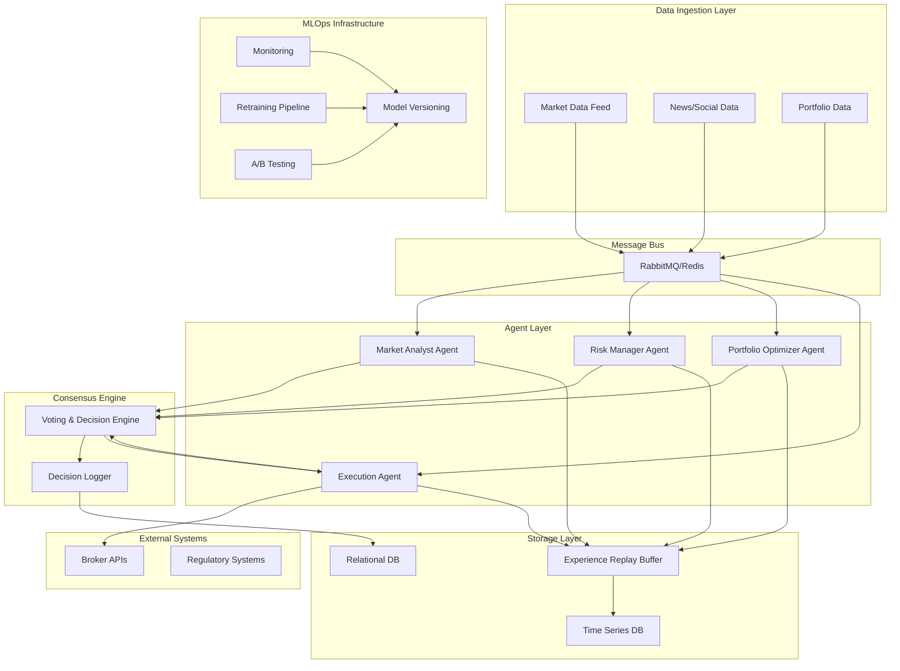
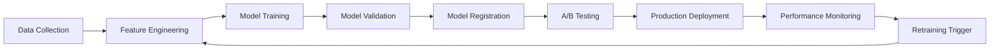

# Multi-Agent Trading System Design Document

## Overview

The Multi-Agent Trading System is designed as a distributed, event-driven architecture where four specialized AI agents collaborate to make trading decisions. The system leverages microservices architecture with containerized agents, message-driven communication, and comprehensive MLOps infrastructure to ensure scalability, reliability, and continuous improvement.

## Architecture

### High-Level Architecture



### Technology Stack

- **Container Orchestration**: Kubernetes for agent deployment and scaling
- **Message Broker**: RabbitMQ for reliable message passing with Redis for caching
- **Programming Language**: Python for ML agents, Go for high-performance components
- **ML Framework**: PyTorch for reinforcement learning models
- **Time Series Database**: InfluxDB for market data and metrics
- **Relational Database**: PostgreSQL for configuration and audit data
- **Model Management**: MLflow for experiment tracking and model versioning
- **Monitoring**: Prometheus + Grafana for system metrics, custom dashboards for trading metrics

## Components and Interfaces

### Agent Base Class

```python
class BaseAgent:
    def __init__(self, agent_id: str, config: AgentConfig):
        self.agent_id = agent_id
        self.config = config
        self.message_bus = MessageBus()
        self.model_manager = ModelManager()
        self.metrics_collector = MetricsCollector()
    
    async def process_message(self, message: Message) -> AgentResponse:
        """Process incoming messages and return agent response"""
        pass
    
    async def vote_on_decision(self, proposal: TradingProposal) -> Vote:
        """Cast vote on trading proposal with confidence score"""
        pass
    
    def update_experience(self, experience: Experience):
        """Add experience to shared replay buffer"""
        pass
```

### Market Analyst Agent

**Responsibilities:**
- Technical analysis using multiple indicators (RSI, MACD, Bollinger Bands, etc.)
- Sentiment analysis from news and social media
- Pattern recognition and trend identification
- Market regime detection

**Key Interfaces:**
```python
class MarketAnalystAgent(BaseAgent):
    async def analyze_technical_indicators(self, market_data: MarketData) -> TechnicalAnalysis
    async def analyze_sentiment(self, news_data: NewsData) -> SentimentAnalysis
    async def detect_patterns(self, price_data: PriceData) -> PatternAnalysis
    async def assess_market_regime(self, historical_data: HistoricalData) -> MarketRegime
```

### Risk Manager Agent

**Responsibilities:**
- Position sizing calculations
- Stop-loss and take-profit level determination
- Portfolio exposure monitoring
- Correlation analysis and risk metrics calculation

**Key Interfaces:**
```python
class RiskManagerAgent(BaseAgent):
    async def calculate_position_size(self, proposal: TradingProposal) -> PositionSize
    async def set_risk_parameters(self, trade: Trade) -> RiskParameters
    async def monitor_portfolio_exposure(self, portfolio: Portfolio) -> ExposureReport
    async def calculate_var_and_cvar(self, positions: List[Position]) -> RiskMetrics
```

### Portfolio Optimizer Agent

**Responsibilities:**
- Asset allocation optimization
- Portfolio rebalancing decisions
- Multi-objective optimization (return vs risk)
- Diversification analysis

**Key Interfaces:**
```python
class PortfolioOptimizerAgent(BaseAgent):
    async def optimize_allocation(self, universe: AssetUniverse) -> AllocationPlan
    async def suggest_rebalancing(self, current_portfolio: Portfolio) -> RebalancingPlan
    async def calculate_efficient_frontier(self, assets: List[Asset]) -> EfficientFrontier
```

### Execution Agent

**Responsibilities:**
- Order routing and execution
- Slippage minimization
- Trade timing optimization
- Broker API integration

**Key Interfaces:**
```python
class ExecutionAgent(BaseAgent):
    async def execute_trade(self, trade_order: TradeOrder) -> ExecutionResult
    async def optimize_execution_timing(self, order: Order) -> ExecutionPlan
    async def route_order(self, order: Order) -> RoutingDecision
    async def monitor_execution(self, execution_id: str) -> ExecutionStatus
```

### Consensus Engine

The consensus engine implements a weighted voting mechanism where each agent provides:
- Vote score (0-100)
- Confidence level (0-1)
- Reasoning/rationale
- Risk assessment

**Decision Algorithm:**
```python
def calculate_consensus(votes: List[Vote]) -> ConsensusResult:
    weighted_score = sum(vote.score * vote.confidence for vote in votes) / sum(vote.confidence for vote in votes)
    variance = calculate_variance([vote.score for vote in votes])
    
    if weighted_score >= 75 and variance <= 40:
        return ConsensusResult(decision=EXECUTE, confidence=weighted_score)
    elif variance > 40:
        return ConsensusResult(decision=MANUAL_REVIEW, reason="High disagreement")
    else:
        return ConsensusResult(decision=REJECT, confidence=weighted_score)
```

## Data Models

### Core Trading Models

```python
@dataclass
class MarketData:
    symbol: str
    timestamp: datetime
    price: float
    volume: int
    bid: float
    ask: float
    technical_indicators: Dict[str, float]

@dataclass
class TradingProposal:
    symbol: str
    action: TradeAction  # BUY, SELL, HOLD
    quantity: int
    price_target: float
    rationale: str
    confidence: float
    risk_metrics: RiskMetrics

@dataclass
class Vote:
    agent_id: str
    proposal_id: str
    score: int  # 0-100
    confidence: float  # 0-1
    rationale: str
    timestamp: datetime

@dataclass
class Experience:
    state: Dict[str, Any]
    action: Dict[str, Any]
    reward: float
    next_state: Dict[str, Any]
    agent_contributions: Dict[str, float]
    timestamp: datetime
```

### Model Versioning Schema

```python
@dataclass
class ModelVersion:
    model_id: str
    version: str
    agent_type: str
    performance_metrics: Dict[str, float]
    deployment_status: str
    created_at: datetime
    model_artifacts: Dict[str, str]
```

## Error Handling

### Agent Failure Recovery

1. **Health Checks**: Each agent implements health check endpoints
2. **Circuit Breaker**: Automatic failover when agent becomes unresponsive
3. **Graceful Degradation**: System continues with reduced agent participation
4. **Backup Models**: Fallback to previous model versions during failures

### Message Delivery Guarantees

1. **At-Least-Once Delivery**: Messages are persisted and acknowledged
2. **Dead Letter Queues**: Failed messages are routed for manual inspection
3. **Retry Logic**: Exponential backoff with maximum retry limits
4. **Message Ordering**: Critical for time-sensitive trading decisions

### Data Consistency

1. **Event Sourcing**: All decisions and state changes are logged as events
2. **CQRS Pattern**: Separate read/write models for performance and consistency
3. **Distributed Transactions**: Two-phase commit for critical operations
4. **Conflict Resolution**: Last-writer-wins with timestamp ordering

## Testing Strategy

### Unit Testing
- Individual agent logic testing with mock data
- Model prediction accuracy testing
- Message handling and serialization testing
- Risk calculation validation

### Integration Testing
- Agent communication flow testing
- Consensus mechanism validation
- End-to-end trading workflow testing
- External API integration testing

### Performance Testing
- Latency testing for real-time decision making
- Throughput testing under high market volatility
- Load testing with multiple concurrent trading opportunities
- Memory and CPU usage profiling

### A/B Testing Framework
- Traffic splitting between model versions
- Statistical significance testing
- Performance metric comparison
- Automated rollback on performance degradation

### Simulation Testing
- Historical backtesting with realistic market conditions
- Monte Carlo simulations for risk assessment
- Stress testing under extreme market scenarios
- Paper trading validation before live deployment

## MLOps Pipeline

### Model Development Lifecycle



### Continuous Learning Pipeline

1. **Experience Collection**: All agent decisions and outcomes are stored
2. **Batch Processing**: Periodic retraining on accumulated experience
3. **Online Learning**: Real-time model updates for rapid adaptation
4. **Model Evaluation**: Continuous performance monitoring and validation
5. **Automated Deployment**: Blue-green deployment with rollback capabilities

### Monitoring and Alerting

**System Metrics:**
- Agent response times and availability
- Message queue depths and processing rates
- Resource utilization (CPU, memory, network)
- Database performance and connection pools

**Trading Metrics:**
- Decision accuracy and profitability
- Risk-adjusted returns by agent
- Consensus agreement rates
- Execution quality metrics

**Alert Conditions:**
- Agent failure or degraded performance
- Unusual market conditions requiring manual intervention
- Risk limit breaches
- Model performance degradation below thresholds

This design provides a robust, scalable foundation for the multi-agent trading system while ensuring reliability, performance, and continuous improvement through comprehensive MLOps practices.