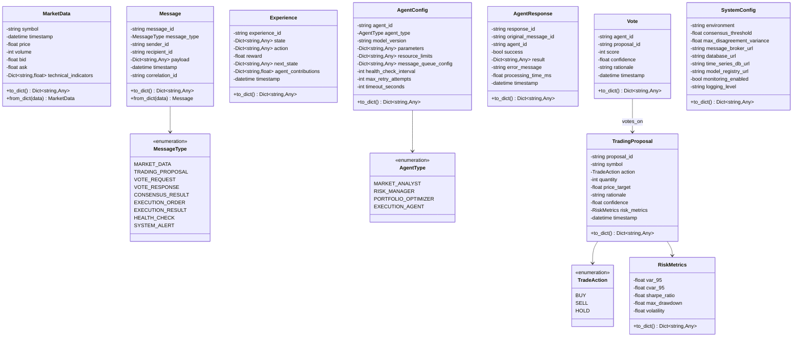
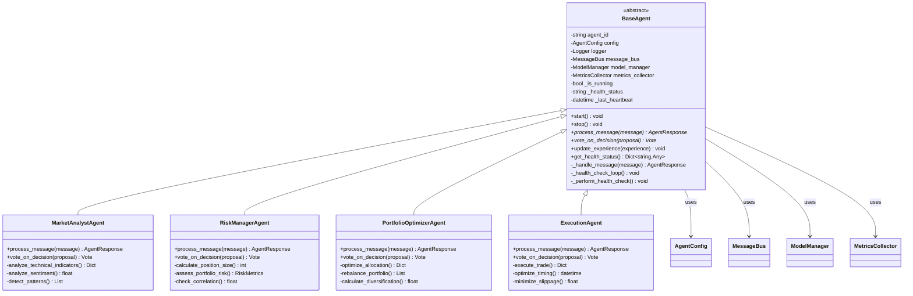
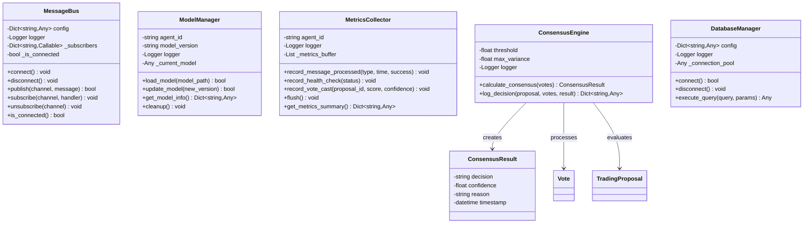
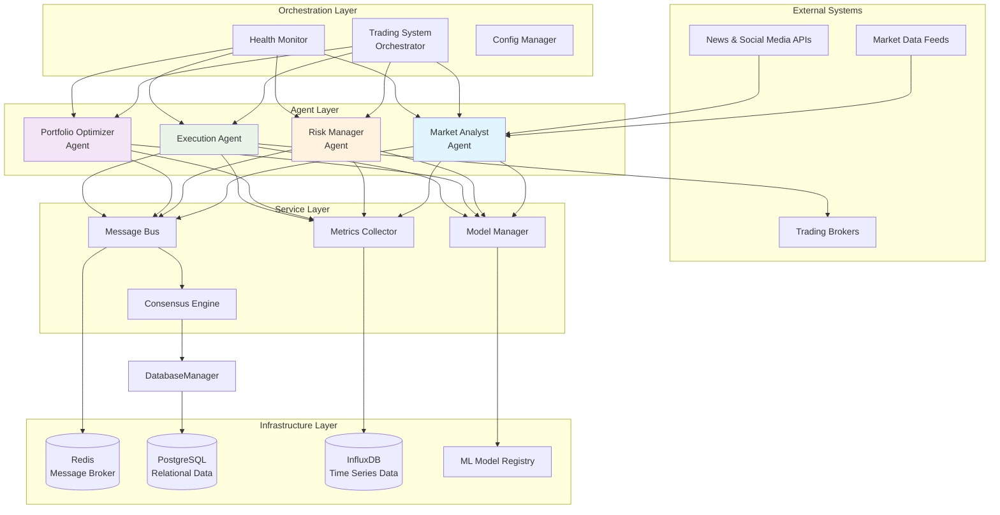
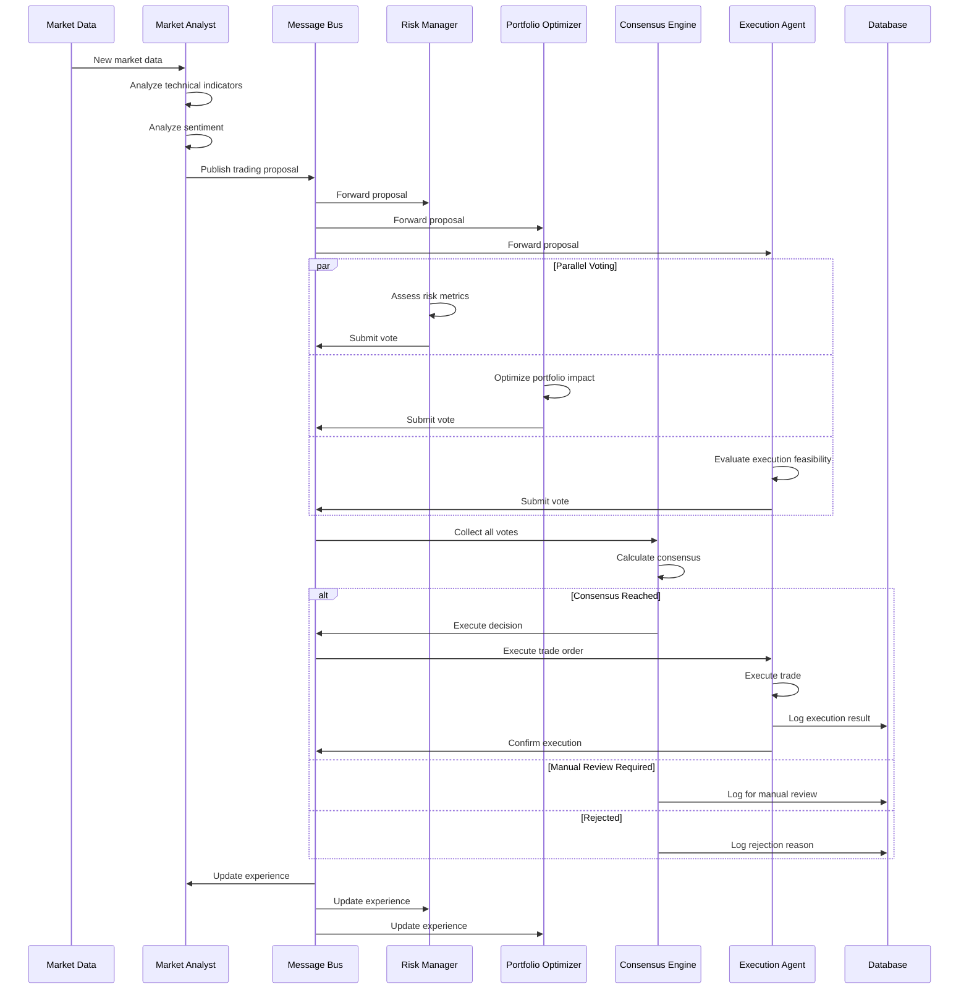
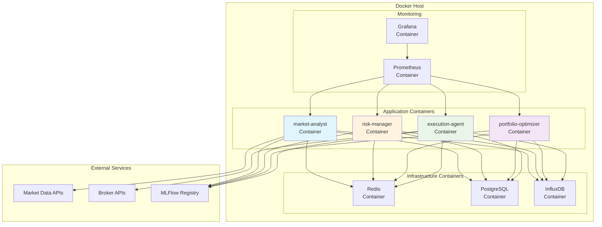
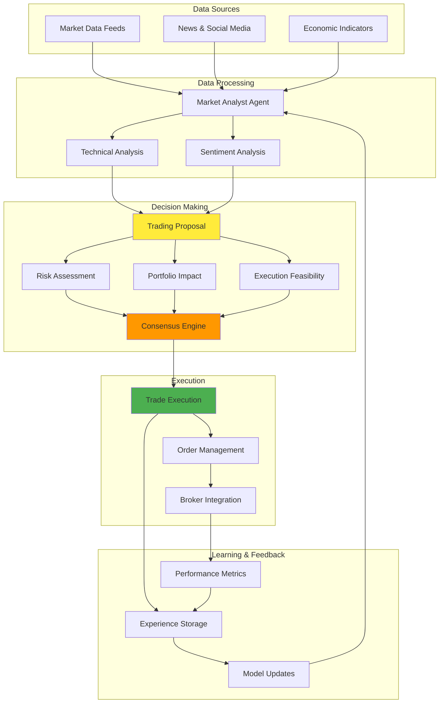

# Multi-Agent Trading System Architecture Diagrams

## 1. Class Diagram - Core Models and Data Structures

## 2. Class Diagram - Agent Architecture

## 3. Class Diagram - Service Layer

## 4. Component Diagram - System Architecture

## 5. Sequence Diagram - Trading Decision Flow

## 6. Deployment Diagram - Docker Architecture

## 7. Data Flow Diagram - Information Architecture

## Architecture Summary

### Key Design Patterns Used:

1. **Observer Pattern**: Message Bus for agent communication
2. **Strategy Pattern**: Different agent types with specialized algorithms
3. **Template Method**: BaseAgent with abstract methods for specialization
4. **Factory Pattern**: Agent creation in the orchestrator
5. **Singleton Pattern**: System-wide configuration management

### Component Relationships:

1. **Inheritance**: All agent types inherit from BaseAgent
2. **Composition**: Agents compose services (MessageBus, ModelManager, MetricsCollector)
3. **Aggregation**: ConsensusEngine aggregates votes from multiple agents
4. **Dependency**: Agents depend on infrastructure services
5. **Association**: Messages associate agents through sender/recipient relationships

### Data Flow Characteristics:

- **Asynchronous**: All agent communication is async via message bus
- **Event-driven**: Agents react to market data and proposal events
- **Consensus-based**: Decisions require agreement from multiple agents
- **Auditable**: All decisions and votes are logged for compliance
- **Scalable**: Horizontal scaling through container orchestration